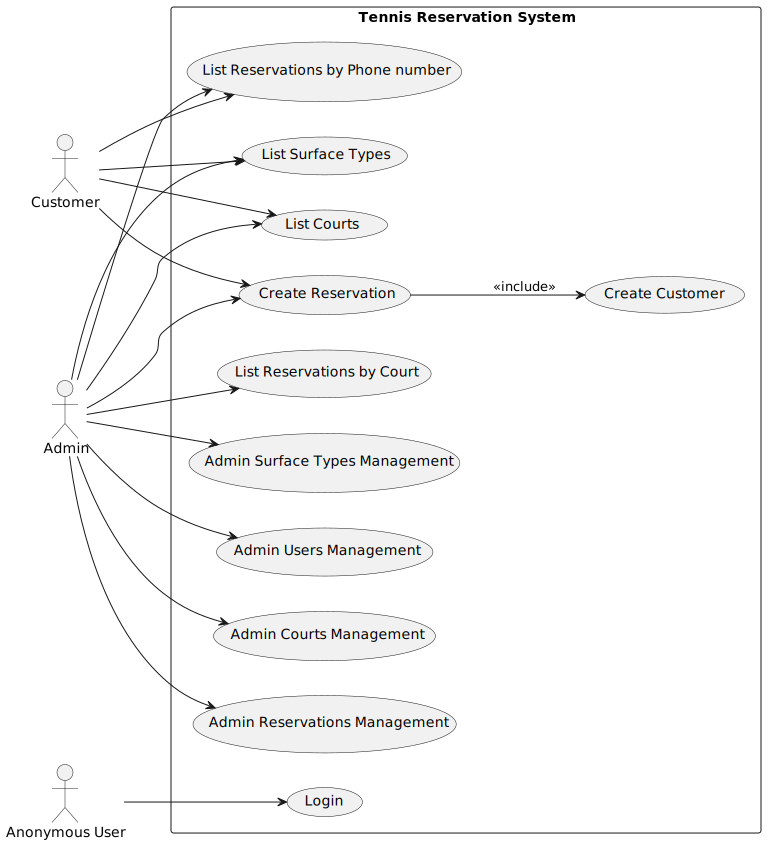
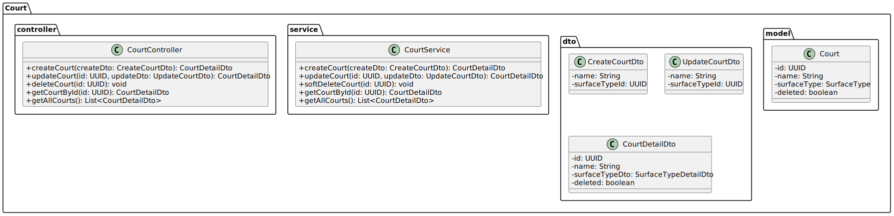
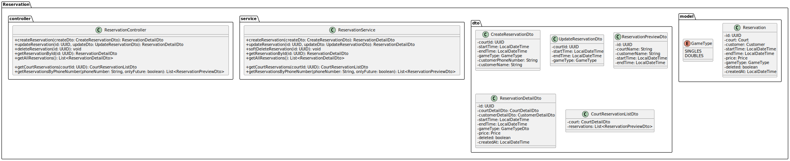

# **TENNIS CLUB RESERVATION SYSTEM**

# InQool Tennis Reservation System

This is a Spring Boot backend application for managing tennis court reservations, built as part of the InQool Java
Developer assignment.

## 💡 Project Overview

This server-side application provides:

- CRUD operations on required features (see below)
- Securing access using **JWT authentication**
- diagrams for use cases and class structures (see below)
- 90+% unit test coverage
- configuration using application.properties file
- data seeding with initial courts, surface types and users (configurable in application.properties)

---

### Showcase and testing

- requires **JDK 21**
- I recommend using Swagger to explore the API endpoints
- http://localhost:8080/swagger-ui/index.html
- login with either of pre-generated users:
    - USER role - email: `user@mail.com`, password: `user`
    - ADMIN role - email: `admin@mail.com`, password: `admin`

---

### Key Features

- CRUD operations for courts (ADMIN only)
- CRUD operations for surface types (ADMIN only)
- CRUD operations for reservations (ADMIN and USER for creating)
- CRUD operations for users (ADMIN only)
- CRUD operations for customers (ADMIN only and automatic creation when creating a reservation)
- `/api/auth/login` endpoint with authentication to obtain a JWT token in the response body

---

## 📦 Tech Stack

- **Java 21**
- **Spring Boot 3**
- **H2 database (in-memory)**
- **Liquibase** for DB migrations
- **Jakarta Validation**
- **Lombok** for boilerplate reduction
- **JWT (JJWT)** for authentication
- **JUnit 5 + Mockito** for testing

---

## ⚙️ Configuration

- `application.properties` for configuration
- datasource settings
- JWT settings (secret, expiration)
- data seeding enabling
- and so on...

---

## 🔐 Authentication

### Roles

- `ADMIN`: Full access to all endpoints
- `USER`: Read-only access + reservation creation
- Unauthenticated users can **create a reservation**, which also creates a user

## Use Case Diagram

---

## Class Diagram – Common Types

---

## Class Diagram – Court

---

## Class Diagram – Surface Type

---

## Class Diagram – Reservation

---

## Class Diagram – Customer

---

## Class Diagram – User

---

## Class Diagram – Auth

---
